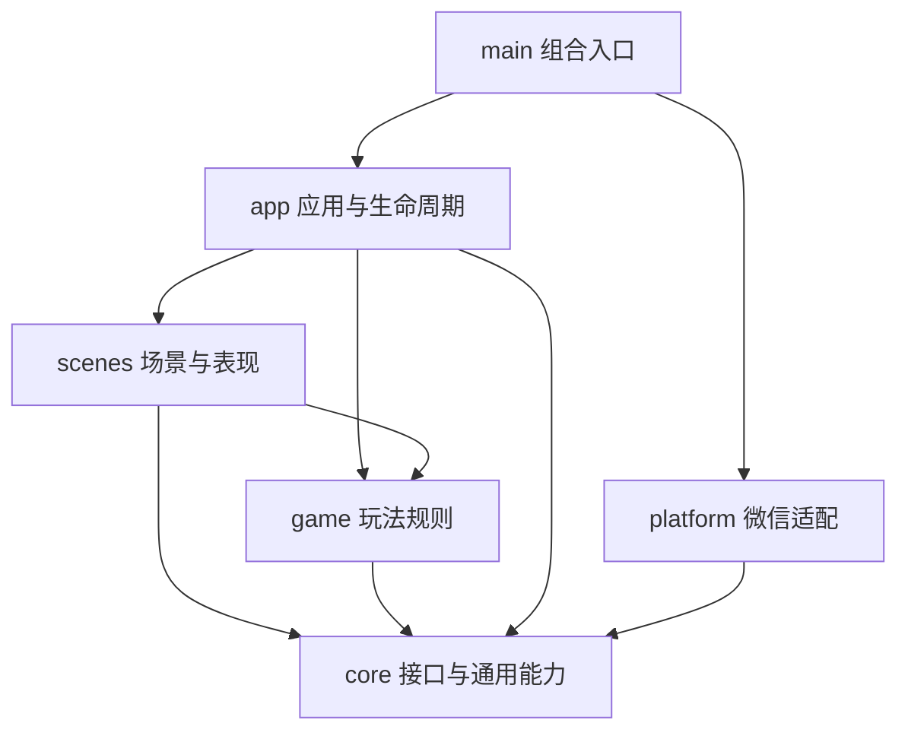

# 架构设计

详细Roguelike系统提案见 [系统框架](design/SYSTEMS.md) 和 [ADR-002](adr/002-roguelike-systems.md)。首版修订见 [ADR-003](adr/003-first-playable.md)。

## 范围

采用 TypeScript + 原生 Canvas 2D + 微信小游戏适配层作为轻量 2D 游戏的起点。
它是应用工程骨架，不是自研通用游戏引擎。当前没有后端、账号、排行榜、广告、支付、ECS 或资源管理框架。
若产品确认需要复杂场景编辑、骨骼动画或 3D，在玩法编码前重新评估 Cocos Creator 等引擎。

## 依赖方向

适配层实现 core 的接口，app 通过注入使用接口，不导入具体微信实现。
game/model保存状态，skills定义39技能/6遗物和选卡，run执行固定步长规则；scenes负责菜单/游戏/奖励/结算绘制，app负责输入路由和生命周期。

| 目录                  | 负责内容                           | 禁止内容                           |
| --------------------- | ---------------------------------- | ---------------------------------- |
| `src/core`            | 时钟/平台接口、帧循环              | 业务规则、平台 API                 |
| `src/game`            | 状态、碰撞、积分等纯逻辑           | Canvas、微信、真实时间和随机副作用 |
| `src/scenes`          | 启动/菜单/游戏/结算的呈现与交互    | 直接调用微信服务                   |
| `src/app`             | 场景编排、生命周期、依赖注入       | 平台实现细节                       |
| `src/platform/wechat` | Canvas、输入、系统信息、前后台事件 | 玩法规则                           |
| `config`              | 提交到仓库的项目配置与内部预算     | 私钥和个人配置                     |
| `assets/runtime`      | 随包发布的已授权资源               | PSD 等设计源文件                   |
| `scripts`             | 构建、配置、工程检查               | 游戏运行时代码                     |
| `tests`               | 纯逻辑及运行时契约验证             | 声称模拟环境等于真机               |

`check-architecture.mjs` 用 TypeScript AST 检查静态导入/导出及常见平台全局访问；
它辅助评审，不是完整的安全分析器。动态加载和第三方运行时包默认不允许，确有需要再扩展 ADR 和检查器。

## 运行约定

- 单一 Canvas，由适配层首次创建；使用逻辑屏幕坐标，绘图缓冲 DPR 限制为 2，控制显存。
- 生命周期：启动 → 注册监听 → 帧循环；隐藏 → 停止；显示 → 重新开始；销毁 → 注销和释放。
- 帧间隔使用秒，首帧及恢复首帧为 0，默认单次增量最大50ms；游戏入口允许250ms并在超过200ms时暂停，避免后台回来时突然跳跃。
- 游戏固定60Hz，每渲染帧最多追5步；升级/奖励/暂停不推进领域时间，恢复后3秒倒数。
- 首个触点转换到360×640逻辑坐标；绘制与输入共用安全区缩放/偏移，横向留边不影响规则。
- 横竖屏暂定竖屏；高性能模式、分包、Worker 和开放数据域按实测需求引入。

## 演进约定

新增能力先定义最小端口和验收场景，再写适配。存档需版本字段、缺失/损坏恢复和迁移测试；
音频需前后台暂停和用户设置；网络需超时、失败回退和服务端信任边界；
随机规则需可注入种子。当前没有这些能力的空实现，避免把占位能力当成可用服务。

新增浏览器预览时实现独立适配器，不能修改玩法层去适应浏览器。
构建目标 ES2020 是工程选择，不代表任意微信版本已兼容；最低基础库和目标设备要在 M1 实测后固定。
