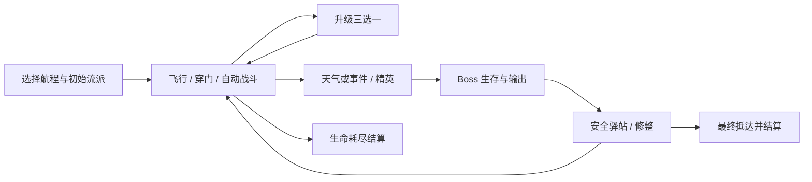

# 《风羽远征》游戏策划案 v0.2（提案）

项目代号 Snappy Bird；中文名暂定。2026-09-18。
**当前交付是可评审的策划与技术方案，不是已经实现的游戏；所有数值均为初始调参值，未证明平衡。**

## 1. 已确认需求与本方案选择

用户已确认：基于 Flappy Bird 的飞行操作，加入 Roguelike；单局几分钟到约半小时；
技能升级为核心，流派丰富且追求平衡；可有怪物、天气、Boss；难度逐渐上升；先策划后开发。

本方案建议：竖屏、单指、单机、原创天空奇幻主题；自动攻击；六流派；标准航程 12 分钟。
这些是本轮待评审的设计选择，不把参考作品的美术、角色和关卡直接搬入项目。
微信小游戏为目标项目类型，沿用已建工程。暂不加入多人、账号、付费强度或强制广告复活。

## 2. 核心体验

一句话：**轻触控制一只飞鸟穿越不断变化的空中险境，用每次升级把普通飞行变成不同的战斗流派。**

三个支柱：

1. 飞行决定风险与收益：高度、穿越时机、靠近敌人都影响技能效果，不能只挂机看伤害。
2. 升级改变行为：穿门引雷、冻弹开路、孵化伙伴、护盾反击等变化先于纯百分比堆叠。
3. 失败可理解：始终有普通飞行可通过的路线，危险有预告；死亡后能看懂原因和构筑短板。

## 3. 操作、生命与战斗

| 项目       | 规则提案                                                                              |
| ---------- | ------------------------------------------------------------------------------------- |
| 基本操作   | 轻触一次拍翅；不触碰自然下降；长按不自动连点；暂停按钮独立于游戏区域                  |
| 横向运动   | 鸟固定在视野约 25% 宽度；世界向左滚动；只能控制高度                                   |
| 攻击       | 武器按冷却自动释放；默认优先前方攻击范围内最近敌人；无敌人时不消耗储备型攻击          |
| 基础参数   | 逻辑视口 360×640；鸟碰撞半径 9；重力 900 单位/s²；拍翅将 vy 设为 -280；下降上限 400   |
| 操作稳定性 | 技能默认不改重力/拍翅力度；局外辅助与大字模式不消耗技能位，也不进入普通排行比较       |
| 生命       | 5 格生命；普通伤害 1 格；Boss 重击最多 2 格且清晰预警；受伤后 1.2 秒无敌              |
| 碰撞恢复   | 撞障碍扣血后推入最近可达安全区域，短暂穿透本障碍；不可在同一管道连续挤压扣血          |
| 屏幕边界   | 顶部软限位不扣血；底部视作地形伤害并救回安全高度；不采用一次触边永久死亡              |
| 判定互斥   | 同一帧多个伤害按危险优先级只结算最高一笔；先伤害再回复，生命降为 0 后不靠同帧吸血复活 |
| 穿门技巧   | 门中心 ±18 逻辑单位为“精准穿门”，同一门只触发一次；普通穿门始终给基础成长             |
| 拾取       | 成长经验自动结算；可选风险路线只给少量额外收益，不要求追逐满屏掉落物                  |

怪物攻击有纵向站位需求，技能通过追踪/范围/持续伤害降低精确瞄准负担。
基础生命给试错空间，危险飞行段没有自动飞行或技能提供的永久无敌。
上述物理参数仅为原型起点，必须先用 60 秒无怪飞行验证手感，再冻结参数。

## 4. 一局的闭环与时长

| 模式 | 有效游玩时间 | 成长次数（初始武器之外） | 场景                      | 定位                             |
| ---- | ------------ | ------------------------ | ------------------------- | -------------------------------- |
| 短途 | 6 分钟       | 12 次                    | 三段各 2 分钟，精简 Boss  | 熟悉系统、碎片时间；标准版后实现 |
| 标准 | 12 分钟      | 18 次                    | 三段各 4 分钟，三个 Boss  | 首个完整版本的平衡基准           |
| 远征 | 24 分钟      | 24 次                    | 六段各 4 分钟，后三段变体 | 熟练后的长构筑；后续内容         |

有效游玩时钟在升级、后台和主动暂停时停止；通常加选择时间约为 7/14/28 分钟。
**主动暂停可以无限延长现实时间，所以“半小时”是正常游玩目标，不是强制墙钟承诺。**
原型另提供 4 分钟验证关，不算正式第四种模式。不做无限模式，避免内容和难度无上限。

标准每段：0–30s 呼吸/教学，30–135s 普通战斗，135–165s 精英或事件，165–180s 安全升级，
180–225s Boss，225–240s 脱离/修整；三段合计 720s。
Boss 45 秒到点后撤退，只要存活即能通关该段；击破奖励更好，但不以 DPS 门槛锁死防御流。
提前击破后进入低威胁飞行直到225s，再进入15s安全驿站；不强迫跳过成长时钟。
安全驿站内鸟自动悬停，玩家可以松手，世界时钟继续但不产生穿门/战斗/技能蓄能事件；
领取修整奖励或进入选卡才冻结时钟。长模式必须专门测手指疲劳，不能仅把12分钟内容复制两次。

## 5. 升级系统与构筑空间

完整目录见 [技能图鉴](SKILL_ATLAS.md)：**48 个流派条目 + 9 个通用条目 + 9 个跨流派条目，共 66 个。**
48 中含 6 个进化条目；不是 66 把武器。完整目标与首版范围有明确区分。

- 开局从六种基础武器中选择一把，获得对应一级；第一次玩推荐风暴但可展开全部选择。
- 常规升级暂停世界并三选一：尽量包含已有构筑成长、另一条可行路线、防御/通用选择。
- 每局 2 次重抽、2 次放逐；重抽按当前候选池重新抽并消耗次数；放逐只影响未来抽取。
- 新流派加入不锁职业；最多 2 个武器位 + 8 个支援位。主武器效率 100%，副武器及其衍生伤害 60%。
- 主副武器只可在安全驿站互换，不能战斗中切换套利。支援位用于普通技能、精通和共鸣。
- 技能升级不额外占位；进化替换对应武器，不额外占位；最多持有 2 个跨流派共鸣。
- 已满级、被放逐、条件不符或没有槽位的条目不进入候选；池耗尽提供临时治疗/护盾/结算币兜底。
- 满血时不提供纯治疗兜底；可同时得到若干临时护盾时受全局上限约束。

每派结构：1 基础武器（3级）、3 机制分支（各3级）、2 功能分支（各2级）、1 精通（1级）、1 进化（1级）。
精通要求该派非进化技能的等级总和 ≥6；进化要求武器3级 + 指定分支2级 + 本派精通，花一次选择。
进化不再强制依赖额外随机神器。达到条件后，两次合适的升级机会内至少出现一次；选择放弃后恢复正常权重。
已满足条件的进化优先于共鸣保底；共鸣最多延后到之后两次升级。保底不穿透放逐或槽位限制。

标准目标：3–4 分钟有明确构筑方向，6–8 分钟可进化，9–11 分钟形成一次跨派联动。
不是每局必须拿进化或共鸣才能赢。精准穿门与杀敌给成长加速，但普通穿门的玩家仍能构筑成型。

## 6. 六派定位

| 流派      | 飞行时的决策                       | 主要收益               | 明确短板                                        |
| --------- | ---------------------------------- | ---------------------- | ----------------------------------------------- |
| 烬羽·火   | 维持敌人处于前方火线，选择爆燃时机 | 持续灼烧、密集敌群连锁 | 低血杂兵未等 DOT 结算已离场，正面投射物处理较弱 |
| 鸣雷·风暴 | 连续精准穿门，积攒并释放电荷       | 高技巧收益、连锁清群   | 失误后增益回落，单体链条收益有限                |
| 霜镜·冰   | 拦住弹幕，为自己创造可飞路线       | 控制、碎冰、弹幕转化   | Boss 只能受弱控制，极端输出不足                 |
| 森灵·自然 | 维持伙伴队列，避伤积累生长         | 伙伴持续输出、有限回复 | 开场弱，需要时间，伙伴不能替玩家飞行            |
| 铁翼·守御 | 选择安全贴近，而非无脑吃伤害       | 护盾、擦弹、反击、容错 | 远距离清场慢，主动挨打不能无限产能              |
| 星轨·奥术 | 穿门蓄能，判断何时进入攻击线       | 轨道、标记、周期爆发   | 爆发空窗、目标切换损失                          |

同等投入下不存在“冰派不能打 Boss”等硬性不可通关情形。环境改变收益，但不设元素免疫。
流派名仅叙事包装；关联标签、前置、叠加与事件触发在技术规格中定义。

## 7. 成长、事件与局外内容

局内成长失败即重置。永久内容以新外观、挑战与侧向初始武器解锁为主，不以局外永久攻击/血量压制新玩家。
完整六派在首版设计中可直接选，不先用数十局刷取检验“多流派”的乐趣。

事件每段最多一个，发生在安全区域：休息巢（回1血或清除一个负面）、风商（换副武器或重抽补给）、
试炼门（主动接受 20s 额外威胁换一次当前阶段合法升级；每局最多一次，取代下一次计划升级提前发放，不增加总次数）。
事件的选择暂停世界；无强迫扣血事件，不出现看广告才能继续。
Boss 奖励为最多回1血与结算货币；击破追加外观解锁进度，不给额外战斗技能压扩大优势。

计分建议：通关/存活距离为主，精准门、精英和击破加分；伤害不是唯一成绩。
暂不做公共排行榜。伤害统计和构筑回顾在本地提供，不采集个人信息。

## 8. 怪物、天气、Boss 与公平性

详见 [关卡与遭遇](ENCOUNTERS.md)。敌人不能随机出生在鸟身上或同时封死唯一安全路径。
天气只在明确的时间窗口生效，不叠加两个强干扰天气；Boss 期间普通天气转为美术背景。
普通障碍必须可依靠基础飞行通过，不能要求某一技能、受伤硬穿或提前知道随机种子。
所有额外弹幕占用统一威胁预算；爆炸、光效和伙伴优先降低自身视觉权重，不掩盖碰撞边界。

## 9. 界面与反馈

- 开局：模式、六派简介、初始武器预览；默认标准模式，原型仅验证关。
- 局内：顶栏生命/护盾、时间与段落；下方简化经验条；右上暂停，避开拇指拍翅区域。
- 升级：大卡片显示“行为变化 → 当前到下一等级数值 → 已拥有的联动”；三选一无需倒计时。
- Boss：剩余时间、可选血条和危险通道预告，明确“存活即可过关”。
- 结算：死因、伤害来源、精准门、已选技能链、一次改进建议；避免把随机坏运气描述成玩家失误。
- 无障碍：粒子强度可调，天气有形状和方向提示，不仅靠红绿色；拍翅反馈可关震动。

局内升级/暂停恢复时世界冻结 3 秒倒计时，恢复后 0.5 秒伤害保护；不重置技能/天气/敌人冷却。
只因升级获得的保护不能触发反击或蓄能，避免反复暂停刷效果。

## 10. 评审重点与下一步

本轮建议先确认五项：**单指+自动攻击、5格血而非一碰即死、12分钟主模式、六派长期目标、原型先做火/雷/铁。**
美术建议明亮手绘剪纸天空，敌弹与场景边缘高对比；不在策划确认前制作完整资产。

确认后按 [开发切片](IMPLEMENTATION_PLAN.md) 推进。数值平衡遵循 [平衡方案](BALANCE.md)，
工程细节见 [系统框架](SYSTEMS.md)。本轮不实现飞行、战斗或技能运行时代码。
