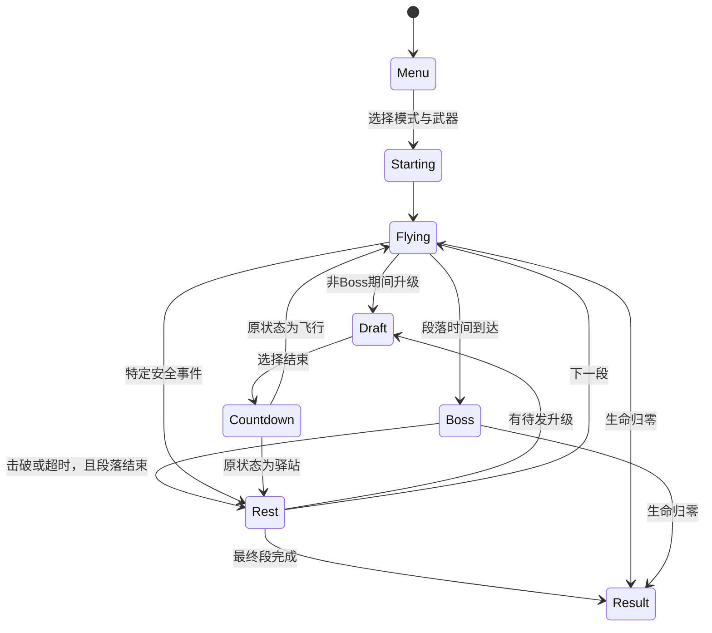

# Roguelike 系统框架 v0.2

状态：架构规格，等待策划确认后实现。本轮不新增玩法运行时代码。
继续使用现有 app/scenes/game/core/platform 分层；简单2D表现仍适合Canvas，不引入通用ECS或复杂引擎。
若原型实体量或资源工作流证实超出此路线，再用ADR评估，不先建设一个大引擎。

## 1. 领域模块

| 计划模块         | 职责                                   | 输出/不得越界                      |
| ---------------- | -------------------------------------- | ---------------------------------- |
| game/run         | RunState、种子、段落、升级队列、胜负   | 纯状态变更，无wx或Canvas           |
| game/flight      | 拍翅、重力、速度约束、可达搜索         | 固定步长，与攻击帧率独立           |
| game/world       | 门、生成器、安全模板、段落编排         | 先验证，再提交生成；不感知实际绘图 |
| game/combat      | 命中、状态、伤害、无敌、死亡唯一性     | 一个确定的结算顺序                 |
| game/skills      | 技能定义解析、效果注册、构筑及触发器   | 受限效果操作，不执行配置字符串代码 |
| game/draft       | 候选过滤、三篮抽卡、保底、放逐         | 独立PRNG流，返回纯卡片数据         |
| game/director    | 怪物/天气/Boss威胁预算与排期           | 不按玩家强势流派暗中针对刷怪       |
| game/progression | 经验、等级、奖励、局内资源             | 统一处理上限与阶段性次数           |
| app/session      | 页面流程、暂停、保存、恢复、音频编排   | 调用平台端口，不直接wx             |
| scenes/*         | 菜单、飞行、升级、结果、HUD            | 从只读快照绘制，不改领域状态       |
| platform/wechat  | 触摸、Canvas、生命周期、音频、本地存储 | 只实现端口，复用领域逻辑           |

目录仅为下一阶段计划，不提前创建几十个空类。以纵向切片逐步落实。

## 2. 状态机



暂停不是覆盖领域阶段的新关卡：保存暂停原因集合（user/background/draft），所有原因清空后才倒计时恢复。
Boss期间升级只排队；已击破但未到段末的时间继续作为安全脱离段。菜单倒计时不推进领域时间。
同一帧如果玩家死亡和Boss死亡同时发生，玩家死亡优先；记录双方事件，不能复活后双结算。

## 3. 时间、输入与确定性

- 逻辑固定60Hz，整数tick；渲染requestAnimationFrame可不同速率，以前后快照插值。
- 每渲染帧最多补5个逻辑步；长期超载显示暂停/降低特效，不用一个巨大的dt跨越碰撞体。
- 当前工程帧循环的50ms裁剪只是启动页保护，游戏阶段替换为显式累加器和超载策略。
- 触摸记录为目标tick的 flap 命令，同tick多触摸合并；只接受游戏区域且不处于选卡/暂停的输入。
- stageTimer、冷却、DOT、状态持续时间均用同一逻辑tick；宿主时间只用于判断前后台和保存节流。
- PRNG拆成world/draft/combat/cosmetic四流，种子由runSeed派生；录制输入不受粒子随机变化影响。
- 模拟使用确定的实体ID排序，不依赖对象遍历偶然顺序或浮点随机。物理数值先统一精度再写回放校验。

## 4. 每tick结算顺序

1. 消费输入 → 拍翅/鸟物理 → 世界位移；拍翅变更不等待渲染。
2. 威胁编排器提交当tick合法生成；更新敌人意图、状态计时和攻击就绪。
3. 武器与伙伴创建攻击 → 移动投射物 → 连续碰撞/扫掠检测（防高速穿透）。
4. 按稳定顺序生成命中与穿门事件；同一个门只产生一次普通通过，再可附加精准或擦翼，奖励互斥策略明确。
5. 伤害/护盾/无敌/控制结算 → 生命归零检查 → 只产生一次死亡事件。
6. 技能触发器消费事件；派生事件走有深度限制的队列，不回调递归；本tick产生的新攻击最早下一tick碰撞。
7. 经验和升级队列 → 段落奖励 → 保存请求；玩家死亡时不再发补血奖励。
8. 产出只读RenderSnapshot与调试统计。音效/粒子通过ViewEvent消费，同事件ID不重复播放。

“精准”和“擦翼”无法同时获得：精准区与边缘区不重叠，计算位置取鸟经过门中心平面时的插值状态。
状态机决定什么事件合法，渲染层不负责清除冷却或发奖。

## 5. 数据驱动技能契约

未来运行数据使用JSON + 显式schema校验，不从Markdown在运行时解析。图鉴是当前设计权威来源。
开发迁移时生成图鉴或建立对比校验，避免图鉴与配置成为两个互相矛盾的真相源。

```ts
type SkillDefinition = {
  id: string; // E01 等永久稳定ID，改名不改ID
  contentVersion: number;
  faction:
    'ember' | 'storm' | 'frost' | 'nature' | 'iron' | 'astral' | 'neutral';
  kind: 'weapon' | 'branch' | 'utility' | 'mastery' | 'evolution' | 'resonance';
  maxRank: 1 | 2 | 3;
  slot: 'weapon' | 'support' | 'replace-weapon';
  prerequisites: Requirement[]; // 等级、派系投入、是否装备，AND默认；禁止循环
  tags: string[]; // direct, dot, shield, gate, charge...
  effectsByRank: EffectDefinition[][];
  replaces?: string;
  excludes?: string[];
};
// EffectDefinition是白名单联合类型，例如onEvent/addBuff/spawnAttack/modifyStat。
// 复杂机制采用代码中显式注册的effectId处理器，不将字符串eval成函数。
```

每个效果需要trigger、cooldownTicks、targetSelector、value、stackRule、procDepthLimit、sourceOwnership。
连锁的所有跳跃共享rootAttackId、同一procDepth和已命中目标集合；只有触发新的技能效果才增加派生代数。
运行实例 SkillInstance 仅保存等级、剩余CD、计数器；不把mutable数据写入静态定义。
示例E08：requires(E01≥3,E02≥2,E07=1)，slot=replace-weapon，replaces=E01；
E01已经产生的在途攻击继续原伤害快照，替换后不再生成旧攻击；支援仍根据统一weapon-family标签工作。

事件至少有eventId/tick/sourceEntityId/sourceSkillId/rootAttackId/parentEventId/procDepth/tags。
伤害快照记录基础值、已使用的增伤桶、主副效率和目标修正，避免共鸣重复乘伤害。
升级后仅未来生成攻击使用新等级；已存在DOT除明确刷新外不回溯改伤害。

## 6. 生成器和威胁编排

导演根据段落和时间选择预算，不根据某玩家刚拿冰系就刷免控怪。
消耗预算的对象包括障碍收窄、活跃敌人、弹幕、天气；暂停/Boss/恢复有单一总开关。
先用人工验证过的模板，再在模板合法边界内取种子随机；生成失败使用安全模板，记录而非死循环重抽。
世界状态的可达性预测与真实物理共用同一积分函数，防止“模拟能过，游戏不能过”。

## 7. 存档、继续与版本

- 一个本地自动存档槽。安全驿站/选择完成/退出后台请求保存；后台触发可靠性需真机验证。
- 存档包含schemaVersion/contentVersion/runSeed/PRNG状态/tick/phase/实体/构筑/CD/次数/未结算升级。
- 采用A/B两槽带递增sequence和校验值，先写新槽成功后切指针；断电取最高有效序号。
- 校验值用于发现损坏，不宣称客户端可防作弊。没有排行榜时不引入登录/签名服务器。
- 恢复进入冻结快照和倒计时；不会重复给过门、段落奖励或治疗。
- 不兼容contentVersion没有迁移时明确告知本局不能继续，保留局外解锁并清除损坏run；不强行载入旧技能ID。
- 中途退到菜单可继续或确认放弃；仅终局才写战绩一次。没有复活广告依赖。

## 8. 性能与可观测性

初始内部预算：普通敌≤8、Boss≤1、敌弹≤16、玩家伤害实体≤64、纯视觉粒子≤100、伙伴≤3。
达到预算时先丢弃粒子；伤害实体采用合批/已明示的技能发射上限，不能悄悄吞掉已承诺的伤害。
Canvas位图缓存静态图层，避免每帧建大量对象；实际是否用对象池由性能数据决定。
目标60FPS，测p95逻辑/渲染耗时与5分钟内存趋势；下调粒子不改逻辑tick。

本地调试记录：seed、内容版本、每派伤害、升级时间、伤害原因、护盾/治疗收益、可达生成回退次数、帧时。
诊断记录默认本地、可导出，不自动上传个人数据；正式遥测另设任务与产品决定。

## 9. 边界与测试映射

纯逻辑测试：技能前置/栈规则/事件去重、固定步长、扫掠碰撞、候选保底、经验封顶、胜负同时发生。
集成回放：同seed与输入结果一致、进化替换不双发、暂停恢复不刷盾、失败存档恢复不重发奖。
平台测试：小屏/长屏、安全区、触控、切后台、音频中断、真机性能和候选上传。
CI加入内容schema和回放校验；本轮只维持已实现工程的检查，不将规划测试标成通过。
